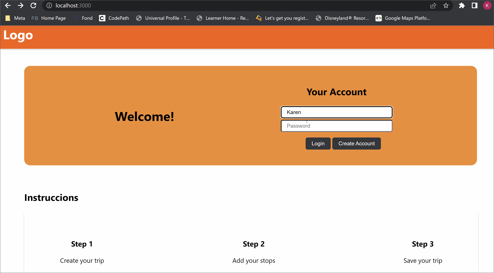

# capstone-project: Roadtrip Planner

## Description

Web app that help you plan your trip and all the neccesary stops. You can visualize your route and different services (such as gas stations, restaurants and hotels) on the same map, so you can know which one is closer to you. You can select where you want to stop, and will save the information of it. You can save the route and all your stops, in case you want to make the trip again in the future.

## Demo

## Core Features

- [x] User can create an account and login
- [x] User can create a trip, giving the origin and destination
- [x] User can know the recommended number of stops depending on the time or distance the person wants to be driving
- [x] User can visualize the route in a map
- [x] User can add different establishments on the same map
- [x] User can add and remove a stop
- [x] User can visualize a summary of the trip
- [x] User can save the trip for future reference
- [x] User can visualize all the saved trips

## Stretch Features

- [x] User can know the recommended number of stops depending on fuel consumption
- [x] User can send the trip via email

### TODO

- Update bounds on searchbox on planner page

## Wireframes

## User Rols

_Driver:_ a user who needs to plan a route

## User Persons

- Daniel is a parent who wants to go on vacation with his familiy. He is a very organized person that plans ahead of time, so he will use the web-app to plan all the neccesary gas stations and restaurants stops on his trip.
- Lizette is a spontaneous young adult that wants to do a road trip. She will use the webb-app to search the best stops where she can go to the restroom and relax from driving.

## User Stories

- As a driver, I want to create or login to my account on Trip Planner
- As a driver, I want to visualize my route, so that I know where to go during my trip.
- As a driver, I want to know the gas stations on my route, so that I could see which ones are close to me.
- As a driver, I want to know the gas stations and restaurants on my route, so that I could see which ones are close to me.
- As a driver, I want to know the hotels on my route, so that I could see which ones are close to me.
- As a driver, I want to plan and save my stops during my trip, so that I could know where to get some rest.
- As a driver, I don't want to worry about where to stop while I'm on the street, so that I could pay attention to the road ahead.
- As a driver, I want to save my favorite routes, so that I could made them again in the future.
- As a driver, I want to know how many stops I have to make depending on the distance of the route, so that I could plan my trip according of the result.
- As a driver, I want to know how many stops I have to make depending on the the gas tank of my car, so that I could plan my trip according of the result.
- As a driver, I want to know how many stops I have to make depending on the the time of the trip, so that I could plan my trip according of the result.

## Endpoints

| **HTTP Verb** | **Name** | **Description**                             |
| ------------- | -------- | ------------------------------------------- |
| POST          | user     | Create a new user account                   |
| POST          | stops    | Add a stop to the user's trip               |
| DELETE        | stops/id | Delete a stop of the user's trip            |
| GET           | map      | Get the map with the route and the services |
| POST          | trip     | Save trip to the user's account             |

## Data Model

### trip

| **column name** | **type**          | **description**                                  |
| --------------- | ----------------- | ------------------------------------------------ |
| id              | integer           | primary key                                      |
| origin          | string            | where the trip begins                            |
| destination     | string            | where the trip stops                             |
| stops           | array of integers | foreign key that indicates the stops in the trip |

### stop

| **column name** | **type** | **description**              |
| --------------- | -------- | ---------------------------- |
| id              | integer  | primary key                  |
| latitude        | float    | location of the stop         |
| longitude       | float    | location of the stop         |
| type            | string   | Type of service              |
| service_id      | integer  | foreign key to service table |

### service

| **column name** | **type** | **description**     |
| --------------- | -------- | ------------------- |
| id              | integer  | primary key         |
| name            | string   | name of the service |
